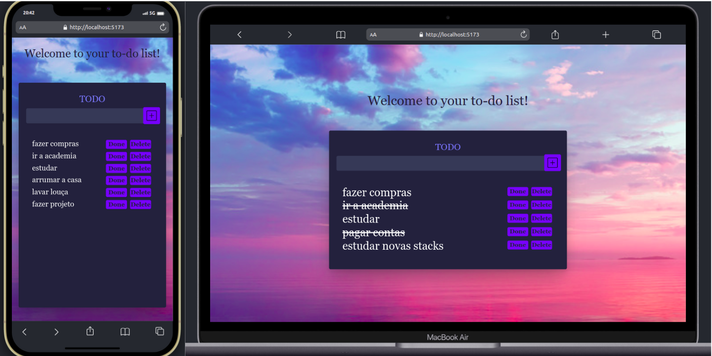

 <h1>Lista de Tarefas</h1>
 
  
Este é um projeto de exemplo de uma aplicação de lista de tarefas com layout responsivo (que se adequa a qualquer formato de tela), desenvolvida em React. Permite ao usuário adicionar, marcar como concluída e remover tarefas da lista.

  
O projeto inclui testes unitários e de integração para garantir o funcionamento correto da aplicação.

  <h2>Layout do Projeto</h2>
  

  <h2>Funcionalidades</h2>

  <ul>
    <li>Adicionar uma nova tarefa à lista</li>
    <li>Marcar uma tarefa como concluída</li>
    <li>Remover uma tarefa da lista</li>
  </ul>

  <h2>Instalação</h2>

  <ol>
    <li>Clone o repositório:</li>
    <code>git clone git@github.com:Elisrenan/prova-startup-franciane.git;</code>
    <li>Navegue até a pasta do projeto:</li>
    <code>cd prova-startup-franciane</code>
    <li>Instale as dependências do projeto:</li>
    <code>npm install</code>
  </ol>

  <h2>Executando os testes</h2>

  
Para executar os testes unitários e de integração, execute o seguinte comando:

  <code>npm test</code>

  
Isso executará todos os testes e fornecerá os resultados no console.

  <h2>Executando a aplicação</h2>

  
Para executar a aplicação localmente, execute o seguinte comando:

  <code>npm run dev</code>

  
Isso iniciará o servidor de desenvolvimento e a aplicação estará disponível no seu navegador

  <h2>Estrutura do projeto</h2>

  
A pasta <code>components</code>contém todos os componentes React, tornando aplicação mais flexível e reutilizável.

  
A pasta <code>images</code> contém as imagens utilizadas na aplicação.

  
A pasta <code>interfaces</code> contém as interfaces da aplicação.

  
A pasta <code>tests</code> contém os testes unitários e de integração.

  
O arquivo <code>README.md</code> contém informações sobre o projeto.

  <h2>Tecnologias utilizadas</h2>

  
TypeScript

  
React

  
Tailwind Css

  
RTL (react-testing-library)

  
Vitest

